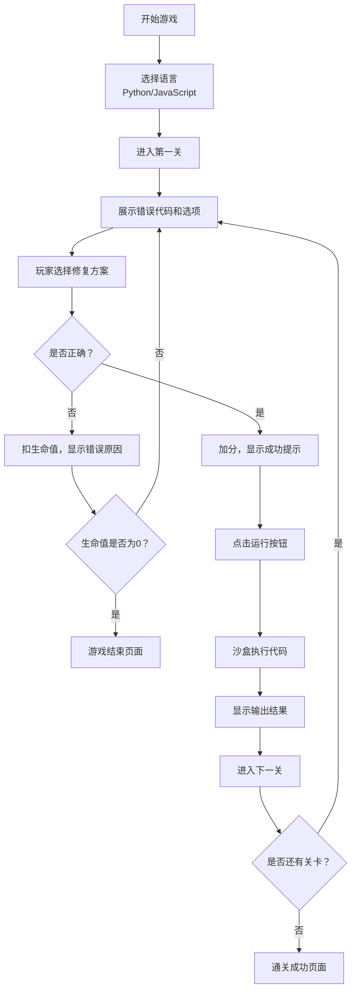

## 1. 产品概述

"语法结构"是一款专为编程初学者设计的代码语法解谜游戏。玩家通过识别和修复代码中的语法错误来学习编程基础知识，支持Python和JavaScript两种语言。游戏采用关卡制，难度逐渐递增，结合了游戏化元素（得分、生命值）与教育元素（知识点学习卡片）。

- **目标用户**：编程初学者、计算机科学入门学生、对编程感兴趣的爱好者
- **核心价值**：在趣味游戏中掌握代码语法基础，通过"犯错-修正"的学习模式加深理解
- **市场定位**：轻量级网页游戏，无需安装，打开即用，适合碎片化学习

## 2. 核心功能

### 2.1 用户角色

| 角色 | 登录方式 | 核心权限 |
|------|----------|----------|
| 普通玩家 | 无需登录 | 体验游戏内置关卡，创建自定义关卡 |

### 2.2 功能模块

1. **游戏主界面**：代码展示区、选项选择区、沙盒运行区
2. **关卡系统**：内置多关卡，难度递增，支持Python/JavaScript切换
3. **代码沙盒**：简化版代码执行环境，可运行代码并显示输出
4. **提示系统**：高亮显示出错行附近，帮助玩家定位问题
5. **自定义关卡**：玩家上传带错误的代码和正确答案，生成新挑战
6. **得分与生命值**：答对得分，答错扣生命值，三次错误游戏结束
7. **学习卡片**：每关展示语法知识点说明
8. **主题切换**：支持暗色/亮色编辑器风格

### 2.3 页面详情

| 页面名称 | 模块名称 | 功能描述 |
|----------|----------|----------|
| 游戏主页面 | 顶部状态栏 | 显示得分、生命值、当前关卡、语言切换、主题切换 |
| 游戏主页面 | 代码展示区 | 展示带有语法错误的代码，支持语法高亮和错误行高亮 |
| 游戏主页面 | 选项选择区 | 展示多个修复选项，玩家点击选择 |
| 游戏主页面 | 操作按钮区 | 提示按钮、运行按钮、下一关按钮 |
| 游戏主页面 | 沙盒输出区 | 显示代码运行结果或错误信息 |
| 游戏主页面 | 学习卡片 | 展示当前关卡的语法知识点 |
| 自定义关卡页 | 代码输入区 | 输入错误代码和正确代码，设置选项 |
| 自定义关卡页 | 预览测试区 | 测试自定义关卡是否正常工作 |
| 游戏结束页 | 结果展示 | 显示最终得分、答对题数、重新开始按钮 |

## 3. 核心流程

玩家还可以选择"自定义关卡"模式，输入自己的错误代码和答案，生成专属挑战。

## 4. 用户界面设计

### 4.1 设计风格

**设计方向**：现代代码编辑器风格 + 游戏化元素

- **主色调**：
  - 暗色主题：深灰蓝背景 (#1e1e2e)，霓虹蓝强调色 (#7aa2f7)，珊瑚粉错误色 (#f7768e)，薄荷绿正确色 (#9ece6a)
  - 亮色主题：米白背景 (#fafafa)，靛蓝强调色 (#3b82f6)，红色错误色 (#ef4444)，绿色正确色 (#22c55e)
- **字体**：
  - 代码区：等宽字体 (Fira Code / JetBrains Mono)
  - 界面文字：现代无衬线字体
- **按钮风格**：圆角矩形，悬停时有微妙的阴影和颜色变化
- **布局风格**：卡片式布局，代码区为核心视觉焦点，左右分栏（代码 + 选项/输出）
- **视觉元素**：行号、语法高亮、错误下划线、当前行标记

### 4.2 页面设计概览

| 页面名称 | 模块名称 | UI 元素 |
|----------|----------|---------|
| 游戏主页 | 顶部状态栏 | 得分数字、生命心形图标、关卡进度条、语言切换下拉、主题切换开关 |
| 游戏主页 | 代码编辑器区 | 行号栏、代码内容、语法高亮、错误行红框/黄底、提示闪烁效果 |
| 游戏主页 | 选项卡片区 | 3-4个选项卡片，悬停上浮，选中高亮，正确/错误状态反馈 |
| 游戏主页 | 沙盒输出区 | 终端风格输出框，>提示符，区分正常输出和错误输出 |
| 游戏主页 | 学习卡片 | 翻转卡片效果，正面"知识点"标签，背面详细说明 |
| 自定义页 | 表单输入区 | 语言选择、标题输入、错误代码文本框、正确代码文本框、选项设置 |
| 游戏结束页 | 结果展示 | 大号得分数字、统计信息、装饰性图标、重新开始按钮 |

### 4.3 响应式设计

- **桌面端优先**：左右双栏布局（左侧代码区 + 右侧选项与输出）
- **平板端**：上下布局，代码区在上，选项和输出在下
- **手机端**：垂直堆叠，适当缩小字号和间距
- **触控优化**：按钮和选项卡片最小触控面积 44px，增加点击反馈

### 4.4 动画与交互

- 代码出现时逐行淡入效果
- 选项卡片悬停时轻微上浮 + 阴影加深
- 答对时绿色闪光 + 得分数字弹跳动画
- 答错时红色闪烁 + 生命值减少动画
- 运行代码时终端打字机效果输出
- 主题切换时平滑过渡动画
- 学习卡片翻转动画
