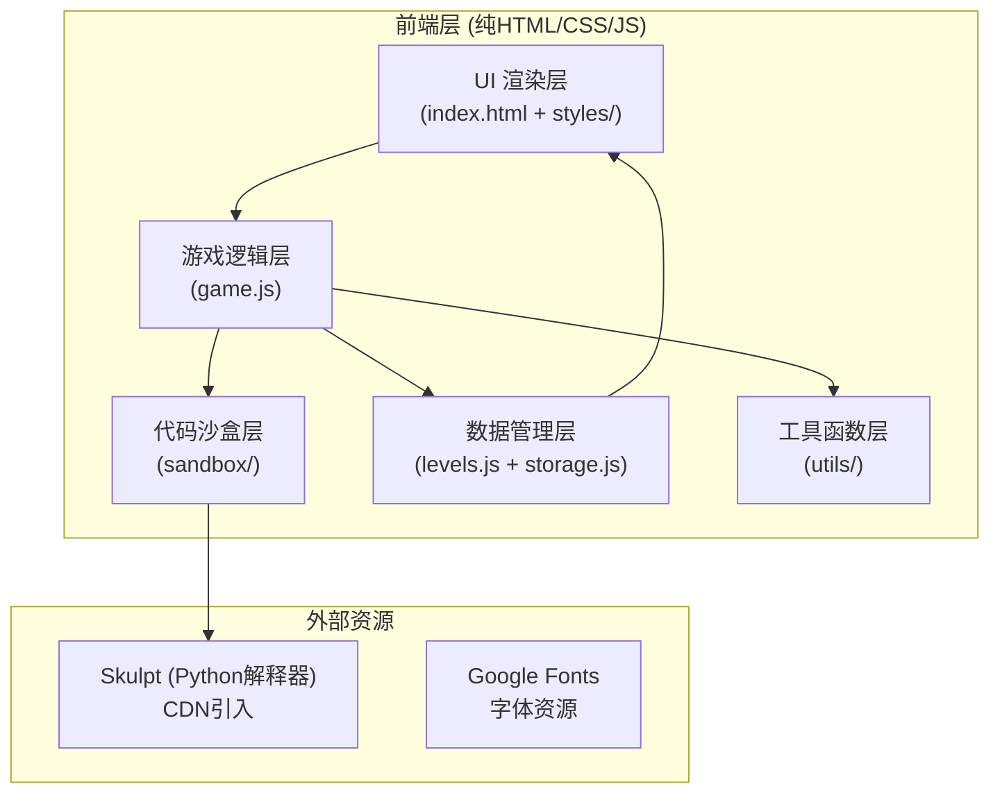

## 1. 架构设计



整体采用单页应用 (SPA) 模式，全部功能在浏览器端完成，无需后端服务。使用 localStorage 存储游戏进度和自定义关卡。

## 2. 技术栈说明

- **前端核心**：原生 HTML5 + CSS3 + JavaScript (ES6+)
- **代码沙盒 - JavaScript**：使用 `eval()` 封装在隔离作用域中运行，重写 console.log 捕获输出
- **代码沙盒 - Python**：使用 Skulpt 库（纯 JavaScript 实现的 Python 解释器），通过 CDN 引入
- **语法高亮**：使用 Prism.js 或自定义轻量级高亮方案
- **数据存储**：localStorage 存储游戏进度、自定义关卡
- **样式方案**：CSS 变量实现主题切换，CSS 动画实现交互效果
- **字体**：Google Fonts - Fira Code (代码) + 系统无衬线字体 (界面)

## 3. 文件结构

```
project/
├── index.html              # 主页面
├── css/
│   ├── style.css           # 主样式
│   ├── themes/
│   │   ├── dark.css        # 暗色主题变量
│   │   └── light.css       # 亮色主题变量
│   └── components/         # 组件样式
│       ├── code-editor.css
│       ├── options.css
│       ├── sandbox.css
│       └── cards.css
├── js/
│   ├── main.js             # 入口文件
│   ├── game.js             # 游戏核心逻辑
│   ├── levels/
│   │   ├── python.js       # Python关卡数据
│   │   └── javascript.js   # JavaScript关卡数据
│   ├── sandbox/
│   │   ├── js-sandbox.js   # JS沙盒
│   │   └── python-sandbox.js # Python沙盒
│   ├── components/         # UI组件
│   │   ├── code-view.js
│   │   ├── options-panel.js
│   │   ├── sandbox-output.js
│   │   └── learning-card.js
│   ├── utils/
│   │   ├── storage.js      # 本地存储
│   │   ├── syntax-highlight.js # 语法高亮
│   │   └── helpers.js      # 工具函数
│   └── custom-level.js     # 自定义关卡逻辑
└── assets/
    └── icons/              # 图标资源
```

## 4. 核心数据模型

### 4.1 关卡数据结构

```javascript
// Level 数据结构
interface Level {
  id: number;
  title: string;
  language: 'python' | 'javascript';
  difficulty: 1 | 2 | 3 | 4 | 5; // 难度等级
  category: string; // 错误类型分类
  buggyCode: string; // 有错误的代码
  correctCode: string; // 正确的代码
  options: Option[]; // 选项
  correctOptionIndex: number; // 正确选项索引
  errorLine: number; // 错误所在行号 (1-based)
  hint: string; // 提示文字
  knowledgePoint: KnowledgePoint; // 知识点
}

interface Option {
  id: string;
  label: string; // 选项展示文字
  code?: string; // 如果是代码修复选项，展示修复后的代码片段
  explanation: string; // 选择后的解释
}

interface KnowledgePoint {
  title: string;
  description: string;
  example: string;
  tip?: string;
}
```

### 4.2 游戏状态

```javascript
interface GameState {
  currentLanguage: 'python' | 'javascript';
  currentLevelIndex: number;
  score: number;
  lives: number; // 初始3条
  selectedOptionIndex: number | null;
  isCorrect: boolean | null;
  hasRun: boolean;
  output: string;
  isGameOver: boolean;
  isWin: boolean;
  showHint: boolean;
  customLevels: Level[];
  theme: 'dark' | 'light';
}
```

### 4.3 自定义关卡存储

使用 localStorage 存储，key 为 `syntax_puzzle_custom_levels`，值为 JSON 数组。

## 5. 核心功能实现方案

### 5.1 代码沙盒

**JavaScript 沙盒：**
- 使用 `new Function()` 创建隔离作用域
- 重写 `console.log` 捕获输出
- 使用 try-catch 捕获运行时错误
- 限制执行时间，防止死循环
- 沙盒中只暴露必要的 API

**Python 沙盒：**
- 使用 Skulpt 库 (Skulpt.org)
- 配置输出回调函数捕获 print 输出
- 捕获语法错误和运行时错误
- 支持基本的 Python 语法和标准库

### 5.2 语法高亮

- 自定义轻量级语法高亮函数
- 支持关键字、字符串、数字、注释的高亮
- 使用正则表达式匹配
- 行号独立渲染

### 5.3 提示系统

- 点击提示按钮后，高亮显示 `errorLine` 附近的代码行
- 错误行添加闪烁动画和特殊背景
- 显示提示文字说明可能的错误类型
- 每个关卡有3次提示机会（或不限次数，影响得分）

### 5.4 得分系统

- 答对：+100分
- 使用提示：-20分（可选）
- 答错：不扣分，但扣1条命
- 连续答对：连击加分（可选）
- 生命值归零：游戏结束，显示最终得分

### 5.5 自定义关卡

- 表单输入：语言、标题、错误代码、正确代码、3-4个选项
- 选项需标记正确答案
- 提供预览功能，可在创建时测试
- 保存到 localStorage
- 自定义关卡可在"自定义"分类下游玩

## 6. 页面/视图定义

由于是单页应用，通过状态切换显示不同视图：

| 视图名称 | 触发条件 | 主要内容 |
|----------|----------|----------|
| 开始界面 | 初始加载 | 游戏标题、选择语言、开始按钮、自定义关卡入口 |
| 游戏界面 | 点击开始 | 代码区、选项区、沙盒输出、状态栏、学习卡片 |
| 游戏结束 | 生命值为0 | 最终得分、答对题数、重新开始 |
| 通关界面 | 完成所有关卡 | 恭喜信息、总得分、再玩一次 |
| 自定义关卡 | 点击创建 | 表单输入区、预览测试区 |

## 7. 性能与安全考虑

### 7.1 性能优化

- 代码高亮使用节流，避免频繁重渲染
- 动画使用 CSS transform 和 opacity，保证 60fps
- 沙盒执行设置超时限制（默认 5 秒）
- 资源按需加载（如 Skulpt 只在选择 Python 时加载）

### 7.2 安全措施

- JS 沙盒在隔离作用域中运行，不访问 DOM 和 window 敏感属性
- 禁止访问 localStorage、document、location 等危险 API
- 输入代码做基本过滤和长度限制
- 自定义关卡数据做 JSON 格式校验
- 不执行任何网络请求相关代码
